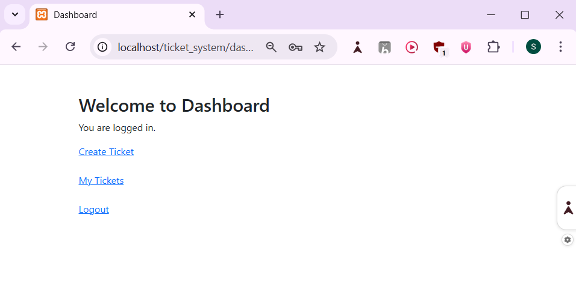
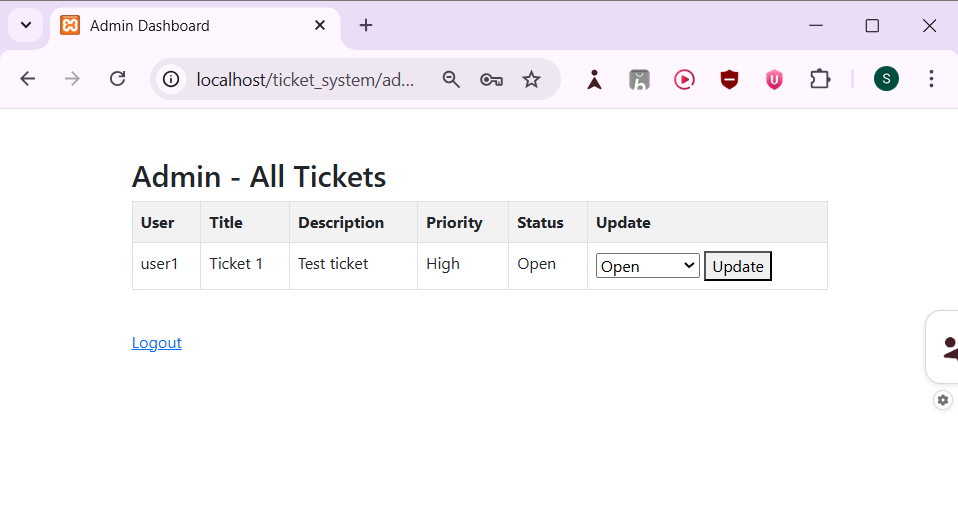

# IT Ticket Management System

## Description
A full-stack web-based IT Ticket Management System built using PHP and MySQL. 
The system allows users to raise support tickets and enables admin users to manage and update ticket status.

## Features
- User Registration & Login (Password Hashing)
- Role-Based Access Control (User/Admin)
- Create, View, Update, Delete Tickets (CRUD)
- Admin Dashboard with Ticket Status Management
- Bootstrap UI Integration

## Tech Stack
- Frontend: HTML, CSS, Bootstrap, JavaScript
- Backend: PHP
- Database: MySQL

## Database Tables
- users
- tickets

## How to Run
1. Install XAMPP
2. Start Apache & MySQL
3. Import database in phpMyAdmin
4. Place project inside htdocs
5. Visit: http://localhost/ticket_system/

## Screenshots

